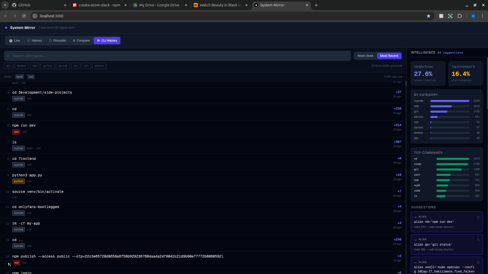
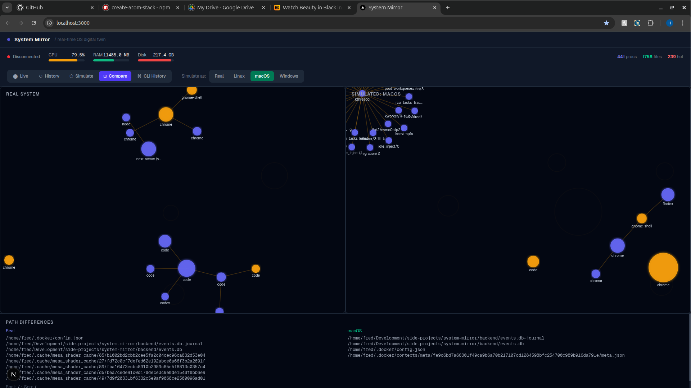

# System Mirror

> A real-time digital twin of your operating system — with cross-OS simulation and CLI intelligence built in.

System Mirror continuously models your running machine as a live, interactive graph. Processes, files, and the relationships between them are tracked in real time, stored historically, and can be re-rendered as if the same activity were happening on a different operating system entirely.

It is not a dashboard. It is a **living model** of your computer.

---

## Why This Exists

Most system monitoring tools answer *"what is happening right now?"* — CPU percent, memory used, disk I/O. System Mirror asks a different set of questions:

- What is the **relationship** between the processes currently running and the files they touch?
- What did my system look like **10 minutes ago**, and how did it get from there to here?
- If I ran this same workload on **Windows or macOS**, how would the filesystem structure and process naming differ?
- What does my **shell history** actually say about how I work — and where am I being inefficient?

These are the questions that matter when you're debugging a misbehaving process, understanding a colleague's environment, or trying to optimize a development workflow that has grown organically over years.

---

## Screenshots

<p align="center">
  
</p>
<p align="center">
  <em>CLI History tab — 3,900+ unique commands parsed from bash and zsh, with frequency ranking, tag filtering, last-used timestamps, and an intelligence sidebar surfacing alias candidates and anti-patterns with one-click copy.</em>
</p>

<br/>

<p align="center">
  
</p>
<p align="center">
  <em>Comparison Mode — the same live process and file activity rendered simultaneously as Linux (left) and simulated Windows (right). Path separators, drive letters, home directory conventions, and executable suffixes are all transformed by the simulation layer.</em>
</p>

---

## Architecture

```
┌─────────────────────────────────────────────────────────┐
│                        Browser                          │
│                                                         │
│  ┌──────────┐  ┌──────────┐  ┌──────────┐  ┌────────┐ │
│  │   Live   │  │ History  │  │Simulation│  │  CLI   │ │
│  │  Graph   │  │ Replay   │  │ Compare  │  │History │ │
│  └────┬─────┘  └────┬─────┘  └────┬─────┘  └───┬────┘ │
│       └─────────────┴──────────────┴─────────────┘      │
│                    Zustand Store                         │
│                    useWebSocket hook                     │
└───────────────────────┬─────────────────────────────────┘
                        │  WebSocket  ws://localhost:8765
┌───────────────────────┴─────────────────────────────────┐
│                    Python Backend                        │
│                                                         │
│  ┌─────────────┐   ┌──────────────┐   ┌─────────────┐  │
│  │   psutil    │   │   watchdog   │   │ cli_history │  │
│  │  monitor   │   │  fs_watcher  │   │   parser    │  │
│  └──────┬──────┘   └──────┬───────┘   └──────┬──────┘  │
│         └────────────┬────┘                  │          │
│                ┌─────┴──────┐    ┌───────────┴───────┐  │
│                │   State    │    │   Intelligence    │  │
│                │   Engine   │    │     Analyzer      │  │
│                └─────┬──────┘    └───────────────────┘  │
│                      │                                   │
│              ┌───────┴────────┐                          │
│              │   Event Store  │  (SQLite via aiosqlite)  │
│              │  + Snapshots   │                          │
│              └────────────────┘                          │
│                                                         │
│              ┌─────────────────────────────────────┐    │
│              │       OS Abstraction Layer           │    │
│              │  normalize → simulate → transform    │    │
│              └─────────────────────────────────────┘    │
└─────────────────────────────────────────────────────────┘
```

### Event Pipeline

Every observable system change becomes a structured event:

```json
{ "type": "FILE_ACCESSED", "path": "/home/user/app/main.py",
  "pid": 12483, "size_bytes": 4096, "timestamp": 1746441600.0 }

{ "type": "PROCESS_UPDATE", "pid": 12483, "name": "python3",
  "cpu_percent": 14.2, "memory_mb": 87.4, "parent_pid": 1103,
  "status": "running", "timestamp": 1746441600.0 }
```

Events are batched every 500ms before being flushed to connected clients — preventing UI overload while keeping latency low. Every event is also persisted to SQLite for time-travel replay.

### State Engine

The `StateEngine` class maintains a central in-memory model derived entirely from the event stream:

```
ProcessState(pid, name, cpu_percent, memory_mb, files_accessed, children, ...)
FileState(path, size_bytes, access_count, is_hot, accessing_processes, ...)
Relationship(source="proc:12483", target="file:/home/user/app/main.py", type="accesses")
```

- **Hot files** are identified when `access_count >= 5` — rendered in red on the graph
- **Stale processes** (status=dead for >30s) are pruned from state and relationships
- **Relationships** are deduplicated via a set; the last 500 are serialized per update

### OS Simulation Layer

Paths and process names are first **normalized** to an abstract form, then **re-projected** onto the target OS:

```
/home/fred/projects/app.py          (real Linux)
        ↓  normalize
/home/user/projects/app.py          (abstract)
        ↓  simulate(WINDOWS)
C:\Users\user\projects\app.py       (simulated Windows)
```

Process name mapping is explicit for well-known tools:

| Real (Linux) | Simulated (Windows) | Simulated (macOS) |
|---|---|---|
| `python3` | `python.exe` | `python3` |
| `bash` | `cmd.exe` | `zsh` |
| `zsh` | `powershell.exe` | `zsh` |
| `vim` / `nvim` | `notepad.exe` | `vim` |
| `grep` | `findstr.exe` | `grep` |

The simulation rebuilds a full `StateEngine` over the transformed events, so the frontend graph is a genuine re-render of simulated behavior — not a cosmetic overlay.

---

## Tech Stack

| Layer | Technology |
|---|---|
| Backend runtime | Python 3.12 |
| WebSocket server | `websockets` 16 (asyncio) |
| Process monitoring | `psutil` 5.9 |
| Filesystem events | `watchdog` 6 |
| Event persistence | `aiosqlite` + SQLite |
| Frontend framework | Next.js 16 (App Router, TypeScript) |
| UI styling | Tailwind CSS 4 |
| Graph visualization | D3.js 7 (force-directed simulation) |
| State management | Zustand 5 |
| Animation | Framer Motion 12 |

---

## Features

### Live Mode
The default view. A D3 force-directed graph renders your running processes and recently accessed files as nodes, with edges representing interactions (file access, process parentage, writes). Node size encodes resource usage; color encodes type and activity level. Hot nodes pulse.

### History Mode
Every event is stored in SQLite with its Unix timestamp. The timeline panel lets you load a past window (last 5 / 10 / 30 / 60 minutes) and scrub through it frame by frame. Each frame replays the full state engine up to that point — so what you see is exactly what the system looked like at that moment.

### Simulation Mode
Select Windows, Linux, or macOS from the toolbar. The backend transforms all recent events through the OS adapter and rebuilds a simulated state graph. The frontend re-renders it. Useful for understanding cross-platform path and process differences before deploying to a different environment.

### Comparison Mode
Split-screen. Left pane shows the real system graph; right pane shows the currently selected simulation target. A diff panel at the bottom lists the first diverging file paths side by side. The layout updates live as new events arrive.

### CLI History Intelligence
Parses shell history files directly (read-only):

| Shell | File | Format handled |
|---|---|---|
| **zsh** | `~/.zsh_history` | `: <timestamp>:<duration>;<command>` |
| **bash** | `~/.bash_history` | Plain lines + `#<timestamp>` blocks |
| **fish** | `~/.local/share/fish/fish_history` | YAML-like `cmd`/`when` blocks |

Commands are aggregated across shells, deduplicated, and enriched with:
- **Usage count** — across all history files combined
- **Last used** — extracted from timestamps where available
- **Tags** — auto-detected: `git`, `docker`, `npm`, `python`, `system`, `dev`, `ssh`, `editor`

The intelligence engine then runs over the aggregated data and produces:

- **Alias suggestions** — known patterns (`git status → alias gs=...`) and heuristic long-command detection (>45 chars, used ≥4 times)
- **Optimization suggestions** — `cat file | grep` → `grep file`, `grep -r` → `rg`, `cd X && ls` → shell function
- **Variety score** — ratio of unique commands to total invocations (higher = more diverse tooling)
- **Tag distribution** — bar chart of invocations by category
- **Top base commands** — frequency of each root binary across your history

---

## Getting Started

### Prerequisites

- Python 3.10+
- Node.js 18+
- A POSIX-compatible shell (Linux or macOS)

### Installation

```bash
git clone https://github.com/your-username/system-mirror
cd system-mirror
```

**Backend:**
```bash
cd backend
python3 -m venv .venv
source .venv/bin/activate
pip install -r requirements.txt
```

**Frontend:**
```bash
cd frontend
npm install
```

### Running

Open two terminals from the project root:

```bash
# Terminal 1 — backend WebSocket server
./start-backend.sh

# Terminal 2 — Next.js dev server
./start-frontend.sh
```

Then open [http://localhost:3000](http://localhost:3000).

The backend starts monitoring immediately. Give it 5–10 seconds for the first batch of process data to populate the graph.

### What the scripts do

`start-backend.sh` creates a Python venv if one does not exist, installs dependencies, and runs `backend/main.py`. The server binds to `ws://localhost:8765`.

`start-frontend.sh` runs `npm run dev` inside `frontend/`. Hot-reload is enabled.

---

## Project Structure

```
system-mirror/
│
├── backend/
│   ├── main.py                 # WebSocket server, message routing, background tasks
│   ├── state_engine.py         # Central in-memory system model
│   ├── system_monitor.py       # psutil process polling (2s interval)
│   ├── fs_watcher.py           # watchdog filesystem event stream
│   ├── event_store.py          # SQLite persistence (events + snapshots)
│   ├── os_abstraction.py       # Path/process normalization + OS adapters
│   ├── cli_history.py          # Multi-shell history parser (read-only)
│   ├── history_intelligence.py # Alias/optimization suggestion engine
│   └── requirements.txt
│
├── frontend/
│   └── app/
│       ├── page.tsx                    # Root layout, mode routing
│       ├── types/system.ts             # Shared TypeScript interfaces
│       ├── store/systemStore.ts        # Zustand store + graph derivation
│       ├── hooks/useWebSocket.ts       # Auto-reconnecting WS client
│       └── components/
│           ├── SystemGraph.tsx         # D3 force-directed graph
│           ├── StatsBar.tsx            # CPU / RAM / disk gauges
│           ├── ModeSelector.tsx        # Tab bar + OS target picker
│           ├── EventFeed.tsx           # Live event stream sidebar
│           ├── Timeline.tsx            # History range selector + scrubber
│           ├── ComparisonView.tsx      # Split-screen real vs simulated
│           └── CliHistory.tsx          # CLI history tab + intelligence panel
│
├── start-backend.sh
├── start-frontend.sh
└── README.md
```

---

## WebSocket Protocol

The client and server communicate via JSON messages over a single persistent WebSocket connection.

**Client → Server:**

| `type` | Payload | Description |
|---|---|---|
| `GET_HISTORY` | `{ start, end }` | Request events in Unix timestamp range |
| `REPLAY` | `{ start, end }` | Request frame-by-frame replay of a time window |
| `SIMULATE` | `{ os }` | Transform recent events for target OS (`linux`, `macos`, `windows`) |
| `SCAN_FS` | `{ path? }` | One-shot recursive directory scan |
| `GET_CLI_HISTORY` | — | Parse and analyze all shell history files |
| `PING` | — | Liveness check |

**Server → Client:**

| `type` | Description |
|---|---|
| `INIT` | Full state snapshot on connection, plus OS profiles |
| `STATE_UPDATE` | Batched state + events every 500ms |
| `HISTORY` | Raw event list for requested time range |
| `REPLAY_FRAMES` | Array of `{ timestamp, state, event }` frames |
| `SIMULATION_RESULT` | Rebuilt state under simulated OS |
| `CLI_HISTORY` | Parsed commands + intelligence analysis |
| `FS_SCAN` | File tree metadata for requested path |

---

## Design Decisions

**Why not send raw psutil data to the frontend?**
Raw process data changes every second across hundreds of PIDs. Sending it directly would saturate the WebSocket and force the browser to do expensive diffing. Instead, the `StateEngine` maintains derived state server-side and only the delta (as structured events + a new snapshot) is emitted per batch interval.

**Why SQLite and not a time-series database?**
The goal for the MVP is zero infrastructure friction — clone, install, run. SQLite with `aiosqlite` gives async access, survives process restarts, and handles the write volume of system events without issue. The schema is append-only (events table + snapshots table), which maps well to a proper TSDB like InfluxDB or TimescaleDB if you want to scale up.

**Why D3 force simulation instead of a library like Cytoscape or Sigma?**
Force simulations express system topology naturally — heavily connected nodes cluster together, isolated processes drift to the periphery. D3's low-level API makes it straightforward to encode resource metrics into visual properties (node radius from memory, color from CPU activity) and add custom interaction behaviors without fighting an abstraction layer.

**Why Zustand instead of Redux or React Context?**
The store is updated at high frequency (every 500ms from the WebSocket). Zustand's selector-based subscriptions mean only components that consume a specific slice of state re-render on each update. Redux would require action/reducer boilerplate that adds no architectural benefit here; Context would trigger full subtree re-renders on every state batch.

---

## Roadmap

- [ ] **Network activity monitoring** — track socket connections per process, visualize as a third node type
- [ ] **Process tree view** — hierarchical parent/child layout mode alongside the force graph
- [ ] **Session clustering** — group CLI history entries into work sessions by time gap
- [ ] **Command replay** — re-execute a command from the CLI history tab with one click
- [ ] **Export** — save the current graph state or CLI analysis as JSON / SVG
- [ ] **Alert rules** — notify when a process exceeds a CPU/memory threshold
- [ ] **Remote agents** — connect to a remote machine's backend over a secure tunnel and mirror it locally
- [ ] **Plugin API** — allow custom event sources to feed the state engine

---

## Privacy

System Mirror runs entirely on your local machine. No telemetry, no analytics, no external requests. CLI history is read from disk into memory for analysis and never written back or transmitted anywhere beyond your local WebSocket connection.

---

## License

MIT
